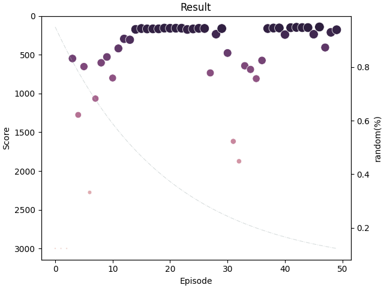

# Mountain-Car (DQN)

## Overview


Running about 40 mins for 143 steps to catch the flag.



*Dot: Steps to catch the flag
**Dashed line: the rate of exponential decay of epsilon

Environment from Gym: https://www.gymlibrary.dev/environments/classic_control/mountain_car/

Action (discrete):

- 0: Accelerate to the left
- 1: Nothing
- 2: Accelerate to the right

## Requirements

```bash
$ pip install -r requirements.txt
```

## Run (CLI)

```
$ python run.py
```

If you want to run with interactive cells, you can convert it from `run.py`
